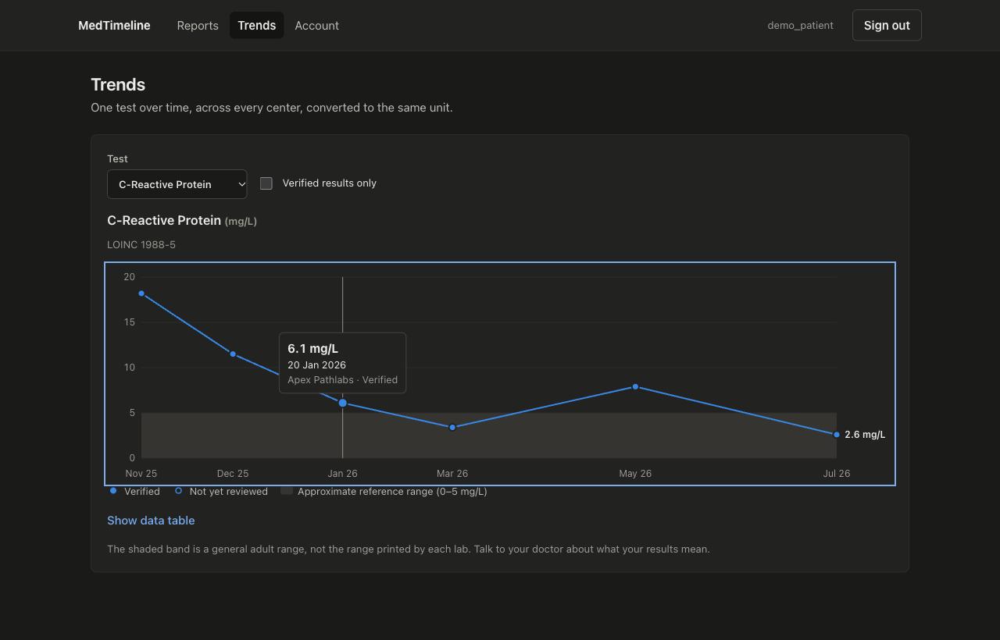
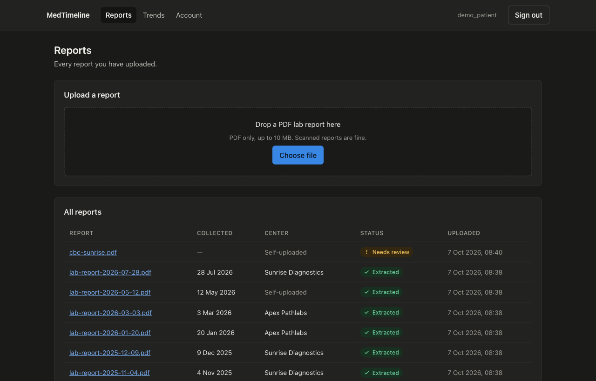
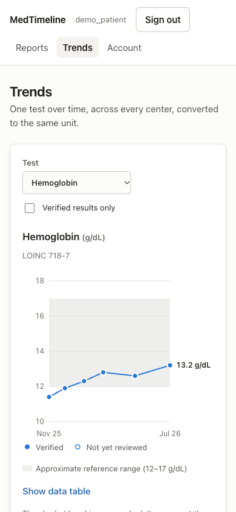
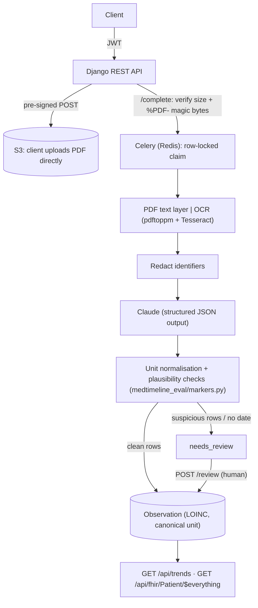

# MedTimeline

**Lab-report PDFs in, one verified LOINC-coded health timeline out.**

[](https://github.com/Purvee25/medtimeline/actions/workflows/ci.yml)
[](LICENSE)


Turns diagnostic lab-report PDFs from different centers into one verified, LOINC-coded health timeline.

Patients and diagnostic-center staff upload reports. A background worker extracts the results with OCR and Claude, validates every value, and stores the clean ones. Anything suspicious waits for a human to review. Patients then see each marker as a trend across labs, and can export their whole record as FHIR.

> [!WARNING]
> **Scope: not a medical device.** Portfolio and learning project. It doesn't diagnose or give dosing advice, and it's not clinically validated. All data in this repo is synthetic; never upload real patient data.

## Contents

- [Highlights](#highlights)
- [Screenshots](#screenshots)
- [Quickstart (Docker)](#quickstart-docker)
- [Frontend](#frontend)
- [Quickstart (local)](#quickstart-local)
- [Architecture](#architecture)
- [API](#api)
- [Measured results](#measured-results)
- [Privacy, safety and security](#privacy-safety-and-security)
- [Standards](#standards)
- [Operations](#operations)
- [Project status / roadmap](#project-status--roadmap)
- [Contributing](#contributing)
- [Security](#security)
- [License](#license)

## Highlights

- **End-to-end pipeline:** direct-to-S3 upload, Celery worker, PDF text layer or Tesseract OCR, redaction, then Claude structured output validated against unit and plausibility rules.
- **Human in the loop:** only clean rows become observations; suspicious values wait for review.
- **Measured, not claimed:** trend query **14.86 ms → 0.03 ms** on 100k observations; rule-based extraction F1 **0.960** on a held-out set.
- **Standards:** LOINC-coded markers, canonical units, FHIR R4 `$everything` export.
- **Privacy by design:** per-purpose consent, object-scoped access (404 across patients and centers), append-only audit log, erasure.
- **Tested and typed:** 54 backend tests, run against Postgres in CI; React 19 + strict TypeScript with zod-validated API responses.

## Screenshots

| Trends (dark) | Reports (dark) |
|---|---|
|  |  |
| **Review (dark)** | **Trends on mobile (light)** |
|  |  |

## Quickstart (Docker)

```bash
cp .env.example .env          # add ANTHROPIC_API_KEY to enable Claude extraction
docker compose up --build     # web UI on :3000, API on :8000, worker, Postgres, Redis, local S3
docker compose exec -e DJANGO_DEBUG=1 web python manage.py seed_demo   # demo accounts + a year of results
```

Open http://localhost:3000 and sign in as `demo_patient` or `demo_staff`. The local-only password is `DEMO_PASSWORD` in `reports/management/commands/seed_demo.py`.

## Frontend

React 19 and TypeScript (strict mode), built with Vite, in `frontend/`.

- React Query handles fetching, caching, and polling while a report is processing.
- Every API response is validated with zod, and React Router handles navigation.
- Screens: sign in and register (with consent), reports (drag-and-drop upload straight to S3, live status), report detail (values held back by validation, and a review form), trends, and account (consents, FHIR export, account deletion).
- The trend chart is a hand-built SVG: a single series in one colour checked for colour-blind safety; filled points for verified values and hollow points for ones awaiting review; a shaded approximate reference band; a crosshair tooltip that also works with the arrow keys; and a data table view. It is laid out at the container's real pixel width, so labels stay readable on phones.
- Light and dark themes follow the system setting.

```bash
cd frontend && npm ci
npm run dev        # http://localhost:5173, proxies /api to Django on :8000
npm test           # Vitest + Testing Library
```

## Quickstart (local)

Requires Python 3.13, Postgres, Redis, `tesseract` and `poppler`.

```bash
python3 -m venv .venv && .venv/bin/pip install -e ".[dev]"
createdb medtimeline && .venv/bin/python manage.py migrate --settings=config.settings_test
.venv/bin/pytest                    # 54 tests: unit, API, worker; S3 mocked with moto
.venv/bin/celery -A config worker   # separate terminal
```

## Architecture



| Package | Responsibility |
|---|---|
| `accounts/` | User roles (patient, center staff), per-purpose consent, JWT auth, erasure |
| `reports/` | Upload flow, extraction task, review, trends, FHIR mapping, audit log |
| `medtimeline_extract/` | PDF → text → redaction → Claude → validated rows (usable without Django) |
| `medtimeline_eval/` | Marker catalogue (LOINC, units, ranges), synthetic report generator, evaluator |
| `frontend/` | React + TypeScript web app: upload, review, trends, account |

## API

| Endpoint | Purpose |
|---|---|
| `POST /api/auth/register/` | Patient sign-up with explicit consent flags |
| `POST /api/auth/token/`, `/token/refresh/` | JWT login (rate-limited) |
| `GET`, `DELETE /api/auth/me/` | Current user; delete erases the account and all report files |
| `GET`, `POST /api/auth/consents/` | List consents, or grant/withdraw one |
| `POST /api/reports/` | Register a report and get a pre-signed S3 upload |
| `POST /api/reports/{id}/complete/` | Verify the upload and queue extraction |
| `GET /api/reports/`, `/{id}/`, `/{id}/download/` | Reports in the caller's scope; short-lived download URL |
| `GET /api/reports/{id}/observations/` | Stored values plus the raw extraction with validation issues |
| `POST /api/reports/{id}/review/` | Replace values with human-verified ones |
| `GET /api/trends/?marker=crp[&patient=…][&verified_only=true]` | One marker over time, all centers, canonical units |
| `GET /api/fhir/Patient/$everything` | Patient's own record as a FHIR R4 Bundle |
| `GET /api/markers/` | Marker catalogue (codes, LOINC, units) for clients |
| `GET /healthz` | Liveness and database check |

## Measured results

| What | Result | How to reproduce |
|---|---|---|
| Trend query, 100k observations / 2k patients | **14.86 ms → 0.03 ms** (seq scan → index scan) | `python manage.py explain_trends` |
| Cross-patient / cross-center access | Denied (404) on view, download, complete, review, trends | `tests/test_api.py`, `tests/test_workflow.py` |
| Extraction F1, rule-based baseline (held-out, 40 reports, 178 fields) | **0.960** overall: 1.000 on the 3 digital layouts, 0.829 on scans | `--extractor baseline`, see below |
| Extraction F1, Claude | *Not yet measured: needs API credits* | see below |

To measure extraction accuracy:

```bash
python -m medtimeline_eval.generate --n 40 --out data/synthetic --seed 7
python -m medtimeline_extract.pipeline --extractor baseline --out data/predictions_baseline   # free, no LLM
python -m medtimeline_extract.pipeline --out data/predictions                                 # calls Claude
python -m medtimeline_eval.evaluate --truth data/synthetic --pred data/predictions_baseline
```

**Baseline results.** The OCR unit repair rule was written by looking at the seed 7 reports, so seed 99 is a held-out set nobody looked at while tuning. Quote the held-out numbers.

| Layout | F1, seed 7 (tuning) before → after unit fix | F1, seed 99 (held-out) before → after unit fix |
|---|---|---|
| table_classic | 1.000 → 1.000 | 1.000 → 1.000 |
| alias_alt_units | 1.000 → 1.000 | 1.000 → 1.000 |
| inline_dotted | 1.000 → 1.000 | 1.000 → 1.000 |
| scanned | 0.548 → 0.929 | 0.683 → **0.829** |
| **All** | 0.901 → 0.984 | 0.927 → **0.960** |

**Error analysis.** On scans, OCR reads values correctly; units are what break. Tesseract turns the caret in `10^3/uL` into `4`, `°`, `%` or a curly quote. `normalise_unit` now repairs those, but only when the whole string is plainly a count unit. The remaining misses are left for human review rather than guessed at: units with a lost leading digit (`403/uL`), `mo/L` for `mg/L`, and rows OCR dropped entirely. The perfect digital scores are partly circular, because the rules and the generator share the same marker catalogue. Real reports will be harder, and that is the gap Claude has to prove it closes.

## Privacy, safety and security

- **LLM data flow:** only redacted text reaches Claude. Lines that contain name, report ID, phone or address, and age/sex values, are removed first; the collection date is kept. Extraction runs only with explicit, withdrawable `llm_extraction` consent. Without it, reports go to manual review.
- **Prompt injection:** report text is sent inside `<report>` tags as data. Output is schema-constrained (`messages.parse` + Pydantic), then validated again against unit and plausibility rules. Report text can never trigger an action.
- **Files:** they go in a private bucket via short-lived pre-signed URLs (5 min), with size and content type enforced by S3. After upload, the server checks the PDF magic bytes and deletes rejected files.
- **Access:** reports are filtered by object scope (patients see their own, staff their center's), with tests for each rule. Every create, view, list, download, review, export and erasure is written to an append-only audit log.
- **Data rights:** FHIR export (access and portability), consent withdrawal, and erasure. Erasure deletes files first, so a storage failure can't leave orphaned health data in S3.
- **Reference ranges** shown in trends are generic and flagged `approximate: true`.

## Standards

- Markers are coded with **LOINC**.
- Units are canonicalised (UCUM codes in the FHIR export).
- `Observation` and `DiagnosticReport` follow **FHIR R4**.
- Imaging (DICOM) and HL7 v2 feeds are out of scope.

## Operations

- **Configuration:** everything comes from environment variables (`.env.example`). The app refuses to start without a secret key unless `DEBUG` is on.
- **Docker image:** multi-stage build, runs as a non-root user, with `HEALTHCHECK`. Compose adds health-gated Postgres, Redis and a moto S3 server.
- **Worker:** acks late, prefetch 1, hard time limit. Transient Claude and S3 errors retry 3× with exponential backoff, then the report is marked `failed` with the reason.
- **Logging:** structured; request IDs and token usage are logged for each Claude call, report contents never are.
- **CI** (`.github/workflows/ci.yml`): ruff, black, a check for missing migrations, and the full test suite against Postgres with Tesseract installed. For the frontend: lint, typecheck, Vitest and a production build.
- **Cost:** Tesseract OCR is free. Each Claude call sends about 1–2k tokens of report text, so the 40-report evaluation costs well under $1. Set an AWS budget alert before deploying.

## Project status / roadmap

Runs end to end locally and in Docker Compose. Not done yet:

- [ ] AWS deployment (RDS, S3, ECS or EC2) and a live demo link
- [ ] Extraction accuracy numbers (run the commands above with an API key)
- [ ] Appointment booking, webhooks, medication log

Design trade-offs are recorded in [DECISIONS.md](DECISIONS.md).

## Contributing

Setup, checks and PR conventions are in [CONTRIBUTING.md](CONTRIBUTING.md). The CI jobs `test` and `frontend` must pass.

## Security

Report vulnerabilities privately; see [SECURITY.md](SECURITY.md). Never include real patient data in issues or PRs.

## License

[MIT](LICENSE) © 2026 Purvee25
